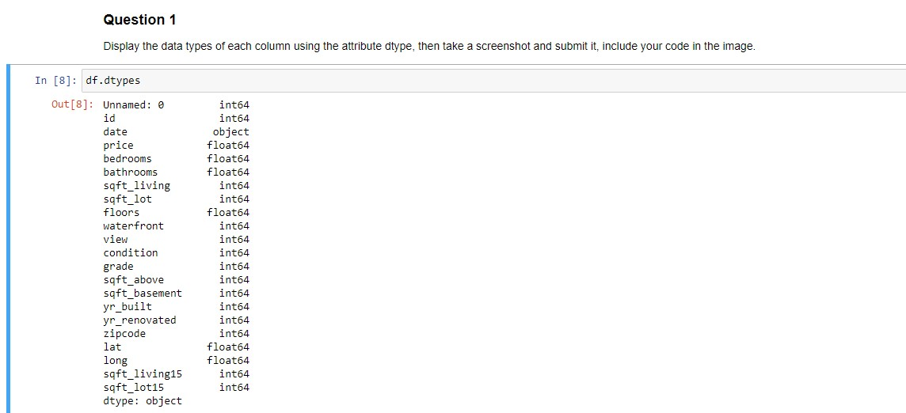
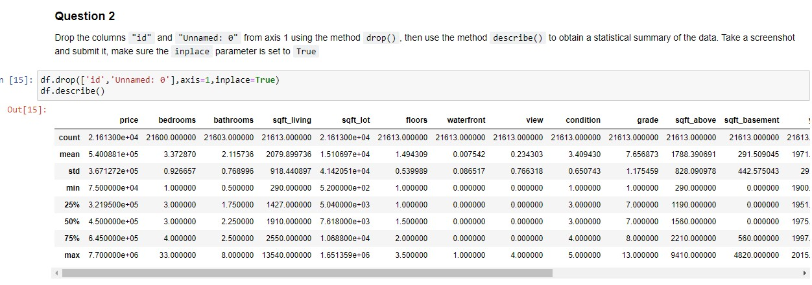
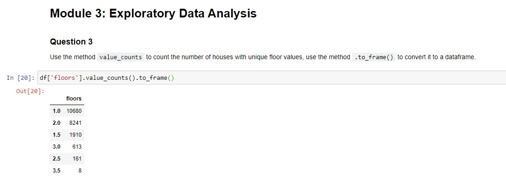
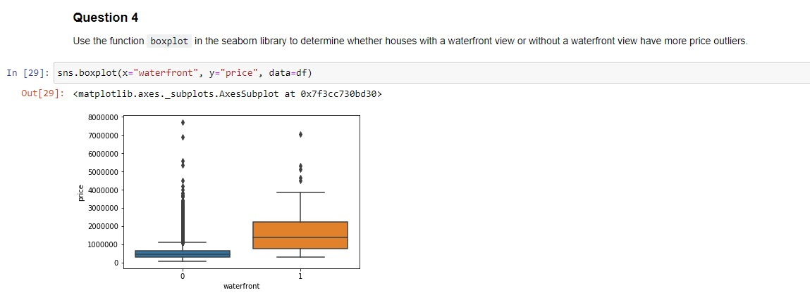
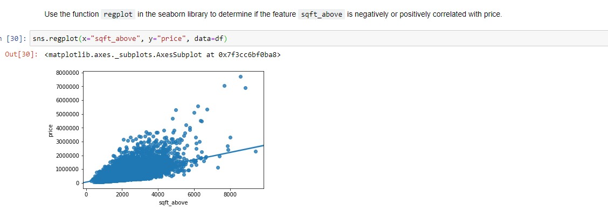

# Final Assignment

## Key Concepts
- Create a Jupyter notebook
- Housing price data

# Peer-graded Assignment: House Sales in King County, USA

**Question 1) Display the data types of each column using the attribute dtype, then take a screenshot and submit it, include your code in the image.**

**Question 2) Drop the columns "id" and "Unnamed: 0" from axis 1 using the method drop(), then use the method describe() to obtain a statistical summary of the data. Take a screenshot and submit it, make sure the inplace parameter is set to True.**

**Question 3) Use the method value_counts to count the number of houses with unique floor values, use the method .to_frame() to convert it to a dataframe**

**Question 4) Use the function boxplot in the seaborn library to produce a plot that can be used to determine whether houses with a waterfront view or without a waterfront view have more price outliers.**

**Question 5) Use the function regplot in the seaborn library to determine if the feature sqft_above is negatively or positively correlated with price. Take a screenshot of the plot and the code used to generate it.**

**Question 6) Fit a linear regression model to predict the price using the feature 'sqft_living' then calculate the R^2. Take a screenshot of your code and the value of the R^2.**

**Question 7) Fit a linear regression model to predict the 'price' using the list of features:**

- **"floors"**
- **"waterfront"**
- **"lat"**
- **"bedrooms"**
- **"sqft_basement"**
- **"view"**
- **"bathrooms"**
- **"sqft_living15"**
- **"sqft_above"**
- **"grade"**
- **"sqft_living"**
- **The calculate the R^2. Take a screenshot of your code and the value of the R^2.**

**Question 8) Create a pipeline object that scales the data performs a polynomial transform and fits a linear regression model. Fit the object using the features in the question above, then fit the model and calculate the R^2. Take a screenshot of your code and the R^2.**

**Question 9) Create and fit a Ridge regression object using the training data, setting the regularization parameter to 0.1 and calculate the R^2 using the test data. Take a screenshot for your code and the R^2**

**Question 10) Perform a second order polynomial transform on both the training data and testing data. Create and fit a Ridge regression object using the training data, setting the regularisation parameter to 0.1. Calculate the R^2 utilising the test data provided. Take a screenshot of your code and the R^2.**

